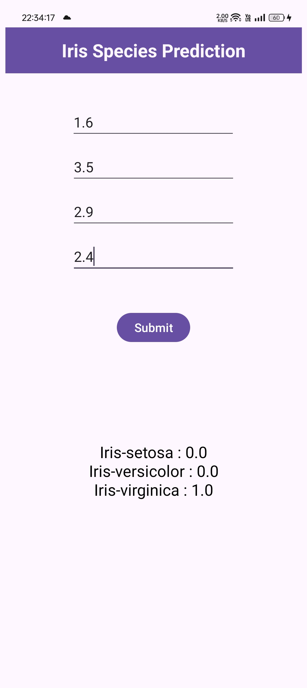

# Iris Species Prediction App

This mobile application predicts the species of an iris flower based on user input of its sepal and petal dimensions. The app leverages a  TensorFlow Lite (TFLite) model to classify the iris species into one of three categories: *Setosa*, *Versicolor*, or *Virginica*. The lightweight model ensures fast and efficient predictions on mobile devices.

## Table of Contents

- [Features](#features)
- [Technologies Used](#technologies-used)
- [Screenshots](#screenshots)
- [How to Run the Project](#how-to-run-the-project)
- [Model Information](#model-information)
- [Code Structure](#code-structure)
- [License](#license)
- [Author](#author)

## Features

- User-friendly interface to input the flower's sepal length, sepal width, petal length, and petal width.
- Instant predictions of the iris species based on the input data.
- Built-in TensorFlow Lite model for on-device, real-time inference.
- Fast, efficient, and lightweight for mobile platforms.
- Supports Android devices with a clean and simple UI.

## Technologies Used

- **Programming Language (App):** Kotlin
- **Development Environment:** Android Studio
- **Machine Learning Library (App):** TensorFlow Lite (TFLite)
- **Programming Language (Model Training):** Python
- **Machine Learning Framework (Model Training):** TensorFlow, Keras
- **Data Processing:** Pandas, NumPy
- **Model Conversion:** TensorFlow Lite Converter

## Screenshots

1. **Light Mode**

<p align="center">
  
</p>

2. **Dark Mode**

<p align="center">
  
</p>

## How to Run the Project

1. Clone the repository:
   ```bash
   git clone <repository-url>
   ```
2. Open the project in Android Studio.
3. Build and run the app on an Android device or emulator.
4. On the app's home screen, input the sepal length, sepal width, petal length, and petal width of the iris flower, then click "Predict" to get the classification result.

## Model Information

The model used in this app is based on the classic Iris dataset. It was trained using Python and TensorFlow/Keras, then converted to TensorFlow Lite format for efficient mobile inference.

### Dataset:

The app uses the well-known **Iris dataset** consisting of 150 samples of iris flowers. Each sample is characterized by four features:

- Sepal Length (cm)
- Sepal Width (cm)
- Petal Length (cm)
- Petal Width (cm)

The task is to classify each sample into one of three species:

1. Setosa
2. Versicolor
3. Virginica

### Python Model Training Script:

```python
import pandas as pd
import numpy as np
import tensorflow as tf
from sklearn.preprocessing import LabelEncoder
from keras.utils import to_categorical
from tensorflow.keras.layers import Dense
from tensorflow.keras.models import Sequential

# Load dataset
df = pd.read_csv('Iris.csv')
# Features and labels
X = df.iloc[:, 1:5].values  # Exclude 'Id'
y = df.iloc[:, 5].values  # 'Species' column

# Label encoding
le = LabelEncoder()
y = le.fit_transform(y)
y = to_categorical(y)

# Build the model
model = Sequential()
model.add(Dense(64, activation='relu', input_shape=[4]))  # 4 input features
model.add(Dense(64, activation='relu'))  # Added activation function here
model.add(Dense(3, activation='softmax'))  # 3 output classes

# Compile the model
model.compile(optimizer='sgd', loss='categorical_crossentropy', metrics=['acc'])

# Train the model
model.fit(X, y, epochs=200)

# Convert the model to TensorFlow Lite format
converter = tf.lite.TFLiteConverter.from_keras_model(model)
tfmodel = converter.convert()

# Save the TFLite model
with open('iris.tflite', 'wb') as f:
    f.write(tfmodel)

print("Model saved as 'iris.tflite'")

```

The model was trained for 200 epochs using the **categorical crossentropy** loss function, optimized with **SGD (Stochastic Gradient Descent)**. Once the model was trained, it was converted to the TensorFlow Lite format using the `TFLiteConverter` for mobile deployment.

## Code Structure

- **MainActivity.kt:** Contains the entire app code, including the UI setup and model inference logic. It loads the TFLite model and takes user inputs to make predictions.
- **assets/iris.tflite:** The pre-trained TensorFlow Lite model used for on-device prediction. This file is loaded during runtime to perform inference based on the provided inputs.

## License

This project is licensed under the MIT License. See the [LICENSE](LICENSE) file for more details.

## Author

Abhishek Rajput
